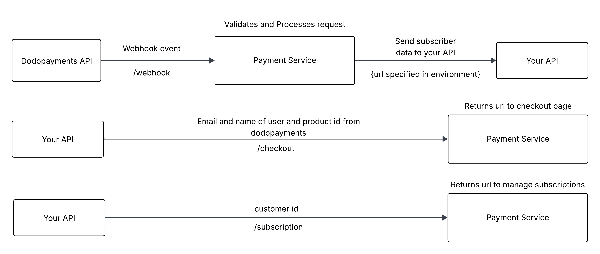

# worker-template-go

A starter template for building Cloudflare Workers with Go. This template uses the [`workers`](https://github.com/syumai/workers) package to create HTTP servers that run on Cloudflare's edge network.



## What is this?

This is a Cloudflare Worker built with Go that integrates with **Dodo Payments** for handling subscription payments and webhooks. The system processes payment events, manages customer subscriptions, and provides API endpoints for checkout flows.

Cloudflare Workers let you run serverless code at the edge, closer to your users. This template helps you build Workers using Go instead of JavaScript, giving you:

- **Type safety** with Go's strong typing system
- **Performance** with compiled Go code running as WebAssembly
- **Familiar syntax** if you're already a Go developer
- **Edge deployment** with automatic global distribution
- **Payment processing** with Dodo Payments integration

## Quick Start

### Prerequisites
- Node.js (for Cloudflare tooling)
- Go 1.24.0 or later
- **Dodo Payments account** - [Register here](https://dodopayments.com) to get your API credentials

### Getting started
```bash
git clone https://github.com/rasadov/PaymentService.git

cd PaymentService

npm run dev
```

## Dodo Payments Setup

This project integrates with **Dodo Payments** for subscription billing and payment processing. You'll need to set up a Dodo Payments account and configure the required environment variables.

### 1. Register with Dodo Payments
1. Go to [dodopayments.com](https://dodopayments.com) and create an account
2. Complete your account setup and verification
3. Navigate to your dashboard to get your API credentials

### 2. Get Your API Credentials
From your Dodo Payments dashboard, you'll need:
- **API Key** - For authenticating API requests
- **Webhook Secret** - For verifying webhook signatures
- **Checkout URL** - Your Dodo Payments checkout endpoint

### 3. Configure Environment Variables
Set up the following environment variables in your Cloudflare Worker:

```bash
# Dodo Payments Configuration
DODO_API_KEY=your_dodo_api_key_here
DODO_WEBHOOK_SECRET=your_webhook_secret_here  
DODO_CHECKOUT_URL=https://checkout.dodopayments.com/your_checkout_id
DODO_CHECKOUT_REDIRECT_URL=https://yourapp.com/success

# Application Configuration  
PAYMENT_CALLBACK_URL=https://your-worker.your-subdomain.workers.dev/webhook
KV_NAMESPACE=your_kv_namespace_name
ENVIRONMENT=production
```

### 4. Set Up Webhooks in Dodo Payments
1. In your Dodo Payments dashboard, go to **Webhooks**
2. Add a new webhook endpoint: `https://your-worker.your-subdomain.workers.dev/webhook`
3. Select the events you want to receive (subscription created, payment succeeded, etc.)
4. Save your webhook configuration

## Project Structure

- `main.go` - Entry point of the application
- `internal/app` - Application instance
- `internal/config` - Configuration for the application
- `internal/db` - Database instance
- `internal/dto` - Data transfer objects
- `internal/handler` - HTTP handlers
- `internal/service` - Business logic
- `internal/payments` - Dodo Payments integration
- `pkg` - Helper functions
- `wrangler.toml` - Cloudflare Worker configuration
- **Config struct** - Environment variables for Dodo Payments integration:
  - `DODO_API_KEY` - API key for Dodo Payments
  - `DODO_WEBHOOK_SECRET` - Secret for webhook signature verification
  - `DODO_CHECKOUT_URL` - Dodo Payments checkout page URL
  - `DODO_CHECKOUT_REDIRECT_URL` - Where to redirect after successful payment
  - `PAYMENT_CALLBACK_URL` - Your webhook endpoint URL
  - `KV_NAMESPACE` - Cloudflare KV storage namespace for data persistence

## Development Commands

| Command | Description |
|---------|-------------|
| `npm start` | Run development server with hot reload |
| `go run .` | Run server locally (without Cloudflare features) |
| `npm run build` | Build Go code to WebAssembly |
| `npm run deploy` | Deploy to Cloudflare Workers |

## Size Limitations

⚠️ **Important**: Cloudflare Workers have size limits:
- **Free plan**: 3MB maximum
- **Paid plan**: 10MB maximum

If your Go application with dependencies exceeds these limits, consider using the [TinyGo template](https://github.com/syumai/workers/tree/main/_templates/cloudflare/worker-tinygo) instead, which produces smaller binaries.

## Customizing Your Worker

The `main.go` file contains an HTTP server with Dodo Payments integration. You can modify it to:
- Add new API endpoints for your business logic
- Customize webhook event handling
- Implement different subscription tiers or products
- Add user authentication and authorization
- Connect to databases or external APIs
- Process different payment events (subscriptions, one-time payments, etc.)

## Payment Flow

1. **Customer initiates checkout** - Your app sends customer data to `/checkout`
2. **Redirect to Dodo Payments** - Customer completes payment on Dodo's secure checkout page
3. **Webhook notification** - Dodo Payments sends payment events to `/webhook`
4. **Process and store** - Your Worker processes the event and updates customer data in Cloudflare KV
5. **Customer redirect** - Customer is redirected back to your success page

## Next Steps

1. **Set up Dodo Payments** - Register and get your API credentials
2. **Configure environment variables** - Add all required Dodo Payments settings
3. **Edit `main.go`** - Implement your business logic and payment handling
4. **Test locally** - Use `npm start` and test with webhook tools like ngrok
5. **Deploy** - Use `npm run deploy` to publish your Worker
6. **Monitor** - Check your Worker logs and Dodo Payments dashboard

For more advanced usage, check out:
- [`workers`](https://github.com/syumai/workers) package documentation
- [Dodo Payments API documentation](https://docs.dodopayments.com)
- [Cloudflare Workers documentation](https://developers.cloudflare.com/workers/)
